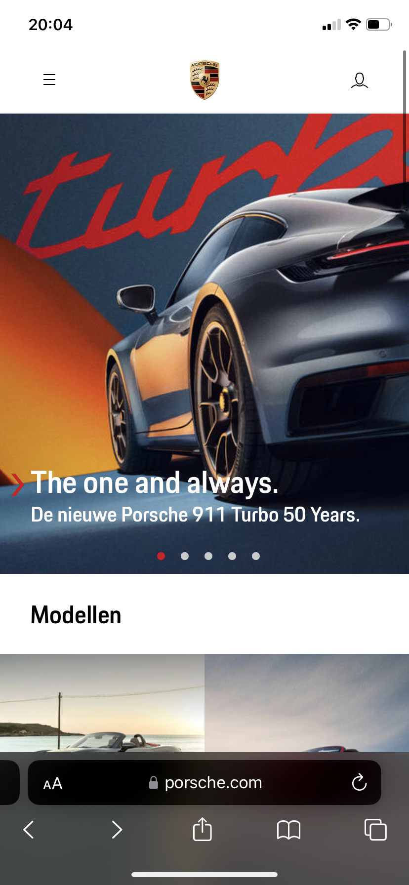
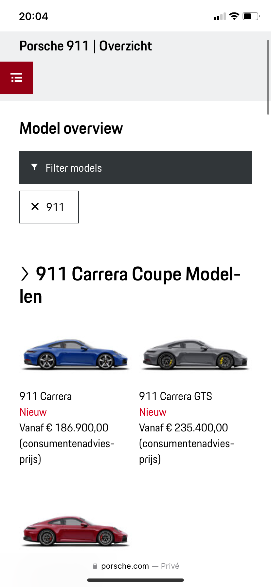

# Procesverslag

Markdown is een simpele manier om HTML te schrijven.  
Markdown cheat cheet: [Hulp bij het schrijven van Markdown](https://github.com/adam-p/markdown-here/wiki/Markdown-Cheatsheet).

Nb. De standaardstructuur en de spartaanse opmaak van de README.md zijn helemaal prima. Het gaat om de inhoud van je procesverslag. Besteedt de tijd voor pracht en praal aan je website.

Nb. Door _open_ toe te voegen aan een _details_ element kun je deze standaard open zetten. Fijn om dat steeds voor de relevante stuk(ken) te doen.

## Jij

  
uitwerken voor kick-off werkgroep

### Auteur:

Thijs Dekker

#### Je startniveau:

Rode piste

#### Je focus:

Surface plane

## Je website

  
uitwerken voor kick-off werkgroep

### Je opdracht:

https://www.porsche.com/netherlands/nl/

#### Screenshot(s) van de eerste pagina (small screen):

Porsche Netherlands - Home

#### Screenshot(s) van de tweede pagina (small screen):

hier de naam van de pagina  
 

## Toegankelijkheidstest 1/2 (week 1)

  
uitwerken na test in 2e werkgroep

### Bevindingen

ELASTIEKJES en SCHOK APPERAAT

Ik begon met de elastiekjes om mijn vingers , ik had ze op willekeurige volgorde om mijn vingers geknoopt en merkte al snel dat om te scrollen je 2 vingers nodig hebt op macbook, en mijn vingers konden niet echt lekker naast elkaar , dus vaak klikte ik verkeerde dingen aan of swipde ik het perongeluk weg. Vooral het perongeluk op dingen klikken gebeurde vaak omdat ik niet goed kon klikken. Wel vond ik de website ruim opgezet en als het lukte om te klikken klikte je dus wel raak. Maar ik kon wel goed de website navigeren .
Vervolgens heb ik de parkenson simulator op mijn arm toegevoegd , dit viel erg tegen aangezien ik bijna niet in staat was om te typen, gelukkig zijn er niet echt dingen waar je moet typen, alles is goed bereikbaar door de navigatie menu's.

VOICE OVER

De voice over functie werkt goed , de tekst en knoppen worden verteld. Ook de foto's van de auto's en de preciese kleur ervan wordt met de gebruiker gecommuniceerd. Alleen probeerde ik op het kruisje in de hoek te klikken en hier kon ik alleen met mijn muis naartoe navigeren omdat de voice over het kruisje oversloeg. Ook is de carrousel die zich in het home scherm bevind erg moeilijk te navigeren.

## Breakdownschets (week 1)

  
uitwerken na afloop 3e werkgroep

### de hele pagina:

  

### dynamisch deel (bijv menu):

  

### wellicht nog een dynamisch deel (bijv filter):

  

## Voortgang 1 (week 2)

  
uitwerken voor 1e voortgang

### Stand van zaken

Bij het opbouwen van de website in html wist ik soms niet of ik UL/LI moest gebruiken of dat ik van bijvoorbeeld een foto collage articles moest maken.

### Agenda voor meeting

samen met je groepje opstellen

| student 1      | student 2          | student 3    | student 4 |
| -------------- | ------------------ | ------------ | --------- |
| dit bespreken  | en dit             | en ik dit    |           |
| en dat ook nog | dit als er tijd is | nog een punt |           |
| ...            | ...                | ...          |           |

Student (thijs) 1: Ik ind het nog moeilijk wanneer ik unordered lists of juist articles moet maken.

Ook heb ik zoveel sections en UL's dat ik niet echt goed weet hoe ik nu een bepaalde ul en Li aanspreek

Moet alles werken? dus elke knop en uitschuif balk etc.

Hoe blijft mijn tekst onder een carrousel?

Student 2:

Student 3:

Student 4:

### Verslag van meeting

- punt 1: Het is nu duidelijk wanneer ik een lijst moet gebruiken op mijn website, op veel plekken waar ik articles had gebruikt had ik beter UL/LI's kunnen gebruiken
- punt 2: Door bijvoorbeeld section ul li:first child / nth-child(2) te doen kun je gemakkelijk bepaalde UL's en LI slecteren
- punt 3: Als ik bepaalde dingen laat werken zal dat natuurlijk meewerken aan mijn surface plane design
- punt 4: ik heb nu een website waar ik gemakkelijk de carrousel kan maken.

## Voortgang 2 (week 3)

  
uitwerken voor 2e voortgang

### Stand van zaken

hier dit ging goed & dit was lastig (neem ook screenshots op van delen van je website en code)

### Agenda voor meeting

samen met je groepje opstellen

| student 1      | student 2          | student 3    | student 4        |
| -------------- | ------------------ | ------------ | ---------------- |
| dit bespreken  | en dit             | en ik dit    | en dan ik dat    |
| en dat ook nog | dit als er tijd is | nog een punt | dit wil ik zeker |
| ...            | ...                | ...          | ...              |

### Verslag van meeting

hier na afloop snel de uitkomsten van de meeting vastleggen

- punt 1
- punt 2
- nog een punt
- ...

## Toegankelijkheidstest 2/2 (week 4)

  
uitwerken na test in 9e werkgroep

### Bevindingen

Lijst met je bevindingen die in de test naar voren kwamen (geef ook aan wat er verbeterd is):

## Voortgang 3 (week 4)

  
uitwerken voor 3e voortgang

### Stand van zaken

hier dit ging goed & dit was lastig (neem ook screenshots op van delen van je website en code)

### Agenda voor meeting

samen met je groepje opstellen

| student 1      | student 2          | student 3    | student 4        |
| -------------- | ------------------ | ------------ | ---------------- |
| dit bespreken  | en dit             | en ik dit    | en dan ik dat    |
| en dat ook nog | dit als er tijd is | nog een punt | dit wil ik zeker |
| ...            | ...                | ...          | ...              |

### Verslag van meeting

hier na afloop snel de uitkomsten van de meeting vastleggen

- punt 1
- punt 2
- nog een punt
- ...

## Eindgesprek (week 5)

  
uitwerken voor eindgesprek

### Je uitkomst - karakteristiek screenshots:

  

### Dit ging goed/Heb ik geleerd:

Korte omschrijving met plaatjes

  

### Dit was lastig/Is niet gelukt:

Korte omschrijving met plaatjes

  

## Bronnenlijst

  
continu bijhouden terwijl je werkt

Nb. Wees specifiek ('css-tricks' als bron is bijv. niet specifiek genoeg).
Nb. ChatGpT en andere AI horen er ook bij.
Nb. Vermeld de bronnen ook in je code.

1. bron 1
2. bron 2
3. ...

